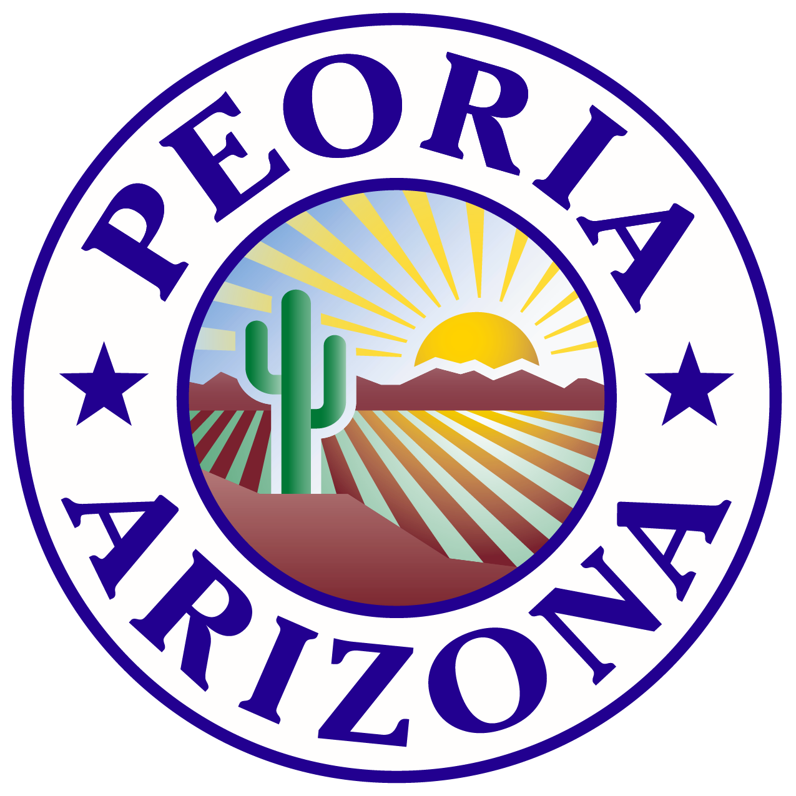
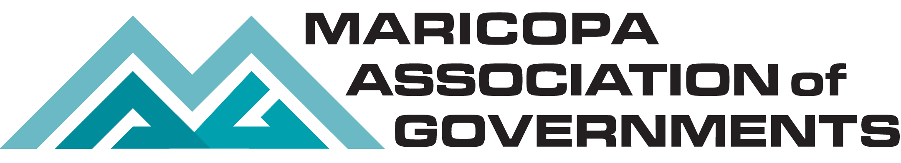

    
    

# Peoria-Business-Resources-Tool

The Maricopa Association of Governments (MAG) mapping page showing businesses open during Coven-19 shutdown.

## :key: Keywords

`economic development` `businesses` `City of Peoria` `Maricopa County` `State` `Arizona` `MAG` `maps` `ESRI` `#MAGmaps`

## dependencies

For changes being made to email notifications, this project will need to also be modified.

- [mag-node-services](https://github.com/AZMAG/mag-node-services)

## Version

### version | 2.2.0

- #### Updated | 2021-03-04

- #### Created | 2020-04-09

Releases will be numbered with the following format:

**`<major>.<minor>.<patch>`**

And constructed with the following guidelines:

1. **MAJOR** version when you make incompatible API changes **bumps the major** resets minor and patch
2. **MINOR** version when you add functionality in a backwards-compatible manner **bumps the minor** resets patch
3. **PATCH** version when you make backwards-compatible bug fixes and misc changes **bumps only the patch**

## :star: Credits

`Maricopa Association of Governments (MAG) and the MAG member agencies`

## :computer: Site URL's

[Peoria Biz Locations](https://geo.azmag.gov/maps/peoriabiz/)

## Technologies

A list of technologies used within the project:

## :zap: Disclaimer

- [DISCLAIMER](DISCLAIMER.md)

## :warning: Licensing

Copyright 2021 Maricopa Association of Governments (MAG)

This project is licensed under the MIT license.

[(Back to top)](#Peoria-Business-Resources-Tool)
